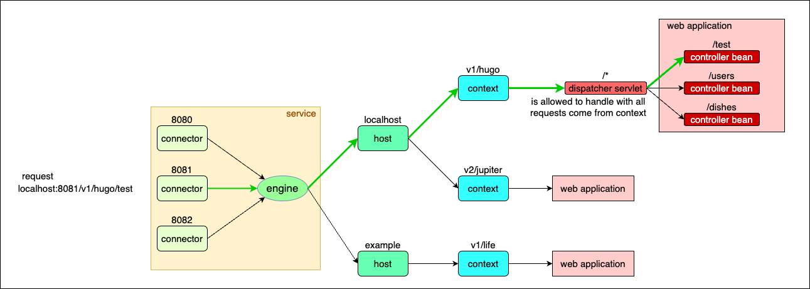
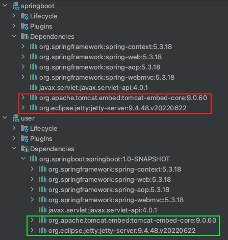
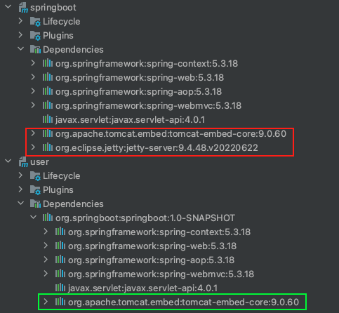

- [Overview](#overview)
  - [Branch Overview](#branch-overview)
- [HTTP Request handling Process](#http-request-handling-process)
  - [The whole process from a higher view](#the-whole-process-from-a-higher-view)
  - [Tomcat](#tomcat)
- [`ShuyuSpringApplication` Class](#shuyuspringapplication-class)
  - [`run()` function](#run-function)
  - [`getWebServer` method](#getwebserver-method)
  - [`startTomcat()` function](#starttomcat-function)
- [`WebServerAutoConfiguration` class](#webserverautoconfiguration-class)
  - [`tomcatWebServer` bean](#tomcatwebserver-bean)
  - [`jettyWebServer` bean](#jettywebserver-bean)
- [`ShuyuConditionalOnClass` annotation](#shuyuconditionalonclass-annotation)
  - [Annotation's input parameter](#annotations-input-parameter)
  - [`@Conditional` annotation](#conditional-annotation)
  - [`ShuyuCondition` class and `Condition` interface](#shuyucondition-class-and-condition-interface)
  - [Process in the `@ShuyuConditionalOnClass` annotation](#process-in-the-shuyuconditionalonclass-annotation)
- [Rules](#rules)
  - [Beans Generation](#beans-generation)
  - [Dependencies](#dependencies)
  - [Annotations](#annotations)


# Overview
This is a tutorial on handwritten Spring Boot source code, designed to simulate the Spring Boot framework. It aims to implement and comprehend the operational mechanisms of various classes and annotations within the Spring Boot framework.

## Branch Overview
1. master: a simple version of Spring Boot powered by Tomcat. it runs on `localhost:8081` and the API is `localhost:8081:test`.
2. p1-multiple-webservers: Use `WebServerAutoConfiguration` to seamlessly switch between Tomcat and Jetty.
3. p2-conditional-annotation: Use `@ShuyuConditionalOnClass` to make code reusable.

# HTTP Request handling Process
## The whole process from a higher view
1. When the application is executed, it initializes all beans from the `.com.liushuyu.user` package, `MyApplication` class as well as `WebServerAutoConfiguration` class. Subsequently, web server starts running, and the `Connector` begins listening to incoming HTTP requests.

2. Upon receiving HTTP requests, the web server parses the URLs to send them to the right controller bean.

## Tomcat
This section provides a detailed explanation of how the embedded Tomcat handles HTTP requests when functioning as the web server. The discussion is based on the code located in `springboot/src/main/java/org/springboot/TomcatWebServer.java`.

Tomcat is composed of several key components:
1. `Service`: Each service can have multiple `Connectors` but only one `Engine`.
2. `Connector`: Listens for incoming requests on a specified port (e.g., port `8081` in this project) and forwards them to the `Engine`. Configuration of the port number is done within the `Connector`, and it is added to the `Service` using `service.addConnector(connector)`.
3. `Engine`: Hosts multiple virtual hosts (`host` in the code). It uses the request's `Host` header to determine the appropriate virtual host when receiving requests from the `Connector`. The `Engine` is added to the Service with `service.setContainer(engine)`.
4. `Host`: Represents the mentioned virtual host. It can contain multiple `Contexts`. The `Host` routes requests to the corresponding `Context` (web application) based on the request's context path (e.g., `/v1/hugo`). Configuration of the host header is done within the `Host`, and it is added to the `Engine` using `engine.addChild(host)`.
5. `Context`: Represents a web application within the web server, bound to only one web application. Configuration of the context path is done within the `Context`.
6. `DispatcherServlet`: This front controller servlet hosts multiple controller beans. It parses the URL to extract its suffix (e.g., `http://localhost:8081/v1/hugo/${suffix}`) and forwards the request to the respective controller beans (handlers) for processing. The servlet connects to the `Context` with the context path by `tomcat.addServlet(contextPath, "anyServletName", new DispatcherServlet(applicationContext))`. The `DispatcherServlet` is able to handle all requests (`/*`) within the Context by `context.addServletMappingDecoded("/*", "dispatcher");`.
7. Web Application: This code `tomcat.addServlet(contextPath, "anyServletName", new DispatcherServlet(applicationContext))` also connects the web application container to the servlet.

This image provides a concise overview of the request flow.



# `ShuyuSpringApplication` Class
We will focus on methods in the `ShuyuSpringApplication` Class to see what happens.

## `run()` function
In the `run()` function:
1. Create a Spring container `applicationContext`.
2. Register the `MyApplication` class as a configuration class within the `applicationContext`.
3. During the refresh process, the Spring container scans and creates beans defined in the `MyApplication` class. This process involves the following steps:
    1. Identify functions annotated with `@Bean` within the `MyApplication` class and include them as beans in the container. For example
    ```java
    import java.beans.BeanProperty;public class MyApplication {
        // ... main ...
   
        @Bean
        public void beanComponents() {
            // This function will be scanned as a bean
        }    
    }
    ```
    2. Parse the `@ShuyuSpringBootApplication` annotation, which is used to annotate the configuration class.
        1. Extract configuration information from the `@ComponentScan` annotations within the `ShuyuSpringBootApplication` interface.
        2. If no specific scan path is provided, the Spring container will scan the package where `MyApplication` is located, which is `com.liushuyu.user`.
        3. The container scans and registers bean components, such as `UserController`, found within the `com.liushuyu.user` package.
    3. After this process, bean components defined in both the `MyApplication` class and the `com.liushuyu.user` package will be scanned and created.
4. Using `getWebServer` employs polymorphism to obtain the user-selected web server. Then the chosen web server is launched with the Spring container. This enables the application to be deployed and accessible through the web server.

## `getWebServer` method
1. Two conditional web server beans, `jettyWebServer` and `tomcatWebServer`, are defined in the `WebServerAutoConfiguration` class. However, only one of them will be instantiated at runtime.
2. During execution, this function retrieves the singular web server bean that has been created and returns it.

## `startTomcat()` function
1. Configure Tomcat parameters to set up the web server environment.
2. Integrate a `DispatcherServlet` into the `applicationContext` container:
    1. The `DispatcherServlet` plays a crucial role in processing incoming HTTP requests and mapping them to corresponding beans based on the URL suffix (e.g., `http://localhost:8081${suffix}`).
    2. By analyzing the URL, the `DispatcherServlet` identifies the appropriate controller bean responsible for handling the request and forwards it accordingly for further processing.


# `WebServerAutoConfiguration` class
This configuration class dynamically generates a web server bean based on specified conditions. To enable this feature, ensure you include the `@Import` annotation in the `ShuyuSpringBootApplication` interface. The `@Import(WebServerAutoConfiguration.class)` annotation enables the instantiation and registration of beans defined in the `WebServerAutoConfiguration` class.

## `tomcatWebServer` bean
This is a conditional bean that is created only when a specified condition evaluates to true. The condition checks for the existence of the class `org.apache.catalina.startup.Tomcat`, typically indicating the presence of the Tomcat dependency.

## `jettyWebServer` bean
This is a conditional bean that is created only when a specified condition evaluates to true. The condition checks for the existence of the class `org.eclipse.jetty.server.Server`, typically indicating the presence of the Jetty dependency. However, the Jetty web server dependency is marked as optional, ensuring that the `user` application remains independent of it.


# `ShuyuConditionalOnClass` annotation
This is a custom conditional annotation to achieve code reusability by replacing previous `JettyCondition` and `TomcatCondition` class.

The `ShuyuConditionalOnClass` annotation is composed of three other annotations: `@Target`, `@Retention`, and `@Conditional`. When the program encounters the `@ShuyuConditionalOnClass` annotation, it will internally process and parse each of the three annotations. However, for our specific analysis, we will focus solely on the functionality provided by the `@Conditional` annotation.
```java
    // Other two annotations.
    @Conditional(ShuyuCondition.class)
    public @interface ShuyuConditionalOnClass {
        String value();
    }
```
## Annotation's input parameter
The `value()` method in the `@ShuyuConditionalOnClass` annotation serves as an input parameter, used to store the string value provided when applying the annotation. When using `@ShuyuConditionalOnClass` on a class or method, we specify the class name as the value for the attribute:
```java
    @ShuyuConditionalOnClass("org.apache.catalina.startup.Tomcat")
    public class MyConditionalBean {
        // Bean definition here
    }
```
To obtain the value of the `value()` attribute in the `ShuyuCondition` class, we use the following code snippet:
```java
    Map<String, Object> annotationAttributes = metadata.getAnnotationAttributes(ShuyuConditionalOnClass.class.getName());
```

## `@Conditional` annotation
The `@Conditional` annotation
```java
    public @interface Conditional {
        Class<? extends Condition>[] value();
    }
```
similar to our `@ShuyuConditionalOnClass` annotation, takes a class type as its input parameter `value()`. This class must extend the `Condition` interface. Consequently, when using `@Conditional`, we pass `ShuyuCondition.class` as the value and create the `ShuyuCondition` class to implement the `Condition` interface. This allows us to define custom conditions for conditional bean registration in the Spring framework.

## `ShuyuCondition` class and `Condition` interface
In the `ShuyuCondition` class, we implement the `Condition` interface, which requires us to define the `matches` method with two parameters: `ConditionContext` and `AnnotatedTypeMetadata`.
1. `ConditionContext`: This parameter gives us access to essential Spring components, such as the Spring Environment and BeanFactory, enabling us to gather relevant information about the application context during runtime.
   For example, we can get BeanFactory and list all beans:
```java
    ConfigurableListableBeanFactory beanFactory = context.getBeanFactory();
    assert beanFactory != null;
    String[] beanNames = beanFactory.getBeanDefinitionNames();

    for (String beanName : beanNames) {
        Class<?> beanClass = beanFactory.getType(beanName);
        if (beanClass != null) {
            System.out.println(beanClass.getName());
        }
    }
```
The `ConditionContext` provides access to the class loader, which is responsible for dynamically loading classes and resources into the Java Virtual Machine (JVM) at runtime. In JVM, class loaders follow a hierarchical structure, establishing a parent-child relationship. Each class in Java is associated with its own unique class loader.
**Note**: It is impossible to directly get all `ClassLoader` instances from the `ConditionContext`, as it doesn't expose a method to retrieve all class loaders. However, you can indirectly access the class loaders of specific packages or loaded classes by their class name using `Objects.requireNonNull(context.getClassLoader()).loadClass(className);`
2. `AnnotatedTypeMetadata`: With this parameter, we can access all direct annotations present on the annotated element. In the context of `ShuyuCondition`, the direct annotations are `org.springframework.context.annotation.Bean`, `org.springboot.ShuyuConditionalOnClass`, and `org.springframework.context.annotation.Conditional`. To verify their presence, we can utilize the following code snippet within the `matches` method of `springboot/src/main/java/org/springboot/ShuyuCondition.java`:
```java
    public class ShuyuCondition implements Condition {
        @Override
        public boolean matches(ConditionContext context, AnnotatedTypeMetadata metadata) {
            MergedAnnotations annotations = metadata.getAnnotations();
            for (MergedAnnotation<Annotation> annotation : annotations) {
                System.out.println("Annotation: " + annotation.getType());
            }
            
            // other codes
        }
    }
```
## Process in the `@ShuyuConditionalOnClass` annotation
1. Upon entering the `WebServerAutoConfiguration` class, our custom `@ShuyuConditionalOnClass` annotation is used to determine the beans that should be created based on certain conditions.
2. As `@ShuyuConditionalOnClass` is composed of three annotations, each of them is sequentially processed. However, our primary focus lies on the `@Conditional` annotation.
3. The `@Conditional` annotation triggers the execution of the `ShuyuCondition.matches()` method, which returns a boolean value. This boolean value plays a pivotal role in determining the creation of specific beans.


# Rules
## Beans Generation
1. Methods that annotated by `@Beans` in the `MyApplication` class.
    1. No beans are instantiated within this method in the current branch.
2. Beans components within the `com.liushuyu.user` package.
    1. `UserController` in the current branch.
3. `WebServerAutoConfiguration` class contains beans imported by the `@Import` annotation in the `ShuyuSpringBootApplication` interface.
    1. `tomcatWebServer` or `jettyWebServer`

## Dependencies
1. Dependency Transitivity:
   The `user` application relies on our Spring Boot framework and therefore depends on all essential dependencies except for the optional ones provided by the framework.
2. Optional Dependency:
   To avoid the `user` application directly depends on Jetty within the Spring Boot framework, we can mark it as an optional dependency. Optional dependencies do not impact the current module's dependencies.
    ```.xml
        <dependency>
            <groupId>org.eclipse.jetty</groupId>
            <artifactId>jetty-server</artifactId>
            <version>9.4.48.v20220622</version>
            <optional>true</optional>
        </dependency>
    ```
   After setting Jetty as optional, the image illustrates its absence.
   

   
3. Exclude Dependency:
   To utilize Jetty as the web server, we exclude Tomcat from the `user` application and incorporate the Jetty dependency.
    ```.xml
        <dependency>
            <groupId>org.springboot</groupId>
            <artifactId>springboot</artifactId>
            <version>1.0-SNAPSHOT</version>
            <exclusions>
                <exclusion>
                    <groupId>org.apache.tomcat.embed</groupId>
                    <artifactId>tomcat-embed-core</artifactId>
                </exclusion>
            </exclusions>
        </dependency>

        <dependency>
            <groupId>org.eclipse.jetty</groupId>
            <artifactId>jetty-server</artifactId>
            <version>9.4.48.v20220622</version>
        </dependency>
    ```

## Annotations
1. Annotation's name: the annotation `@RequestMapping` has the name `org.springframework.web.bind.annotation.RequestMapping`.
2. Annotated type: The "annotated type" of `@RequestMapping` depends on where the annotation is used.
    1. When `@RequestMapping` is applied at the class level,
        ```java
            @Controller
            @RequestMapping("/users")
            public class UserController {
                // ...
            }
        ```
       The annotated type is `UserController`.
    2. When `@RequestMapping` is applied at the method level,
         ```java
             @Controller
             @RequestMapping("/users")
             public class UserController {
 
                 @RequestMapping("/list")
                 public String userList() {
                     // ...
                 }
 
                 @RequestMapping("/create")
                 public String createUser() {
                     // ...
                 }
             }
         ```
       In this case, the "annotated type" refers to the `userList()` and `createUser()` methods, which are annotated with `@RequestMapping` at the method level.
3. Input parameters: In the annotation definition, we use methods to represent input parameter. For example:
    ```java
    @Conditional(ShuyuCondition.class)
    public @interface ShuyuConditionalOnClass {
        String value();
    }
    ```
Here the `ShuyuConditionalOnClass` will take a string variable as the input parameter. So, when we are using it we need to use it in this way:
```java
@ShuyuConditionalOnClass("org.apache.catalina.startup.Tomcat")
public class MyConditionalBean {
// Bean definition here
}
```
4. When an annotation comprises multiple sub-annotations, it can be considered a combination of these sub-annotations. This implies that when the program encounters such an annotation, it will internally process and execute each of the sub-annotations contained within it.


[<< Prev Branch](https://github.com/liushuyu6666/Hugo_Spring_Boot/blob/p1-multiple-webservers/Readme.md)

[>> Next Branch](https://github.com/liushuyu6666/Hugo_Spring_Boot/blob/p3-import-multiple-auto-config-class/Readme.md)